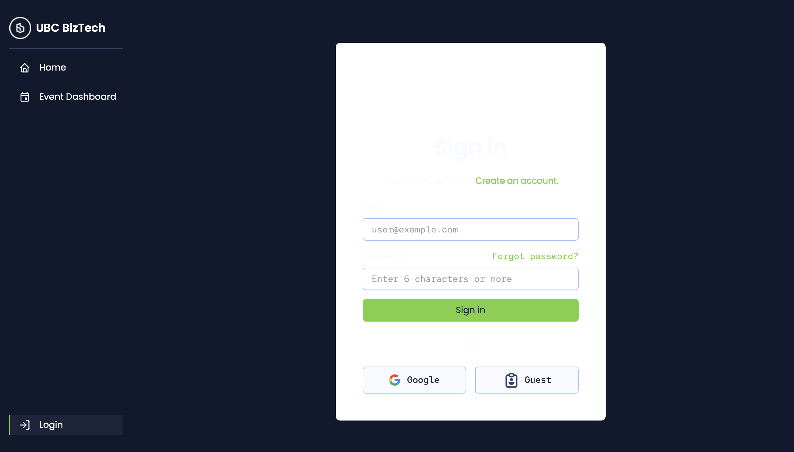
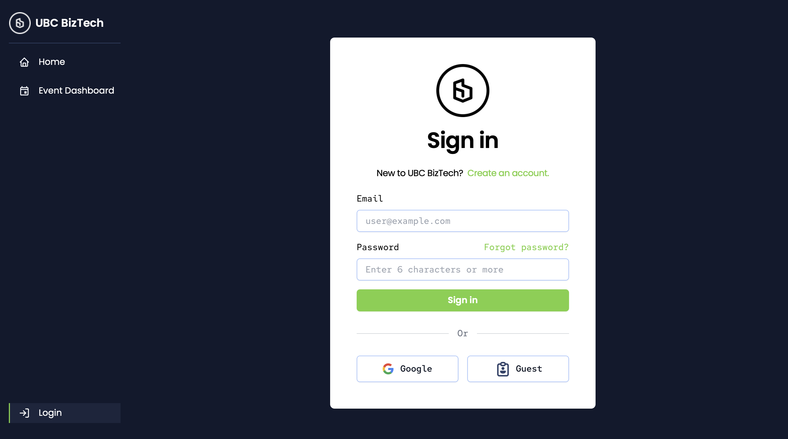

## Describe your changes
- Fixed contrast issues on login component as it wasn't visible before.
- Input color was the same as background color on Firefox, which is now fixed.
- Lot's of other lack of firefox support, ("or", "Google", "Guest"), which were fixed using inline styles.
- BizTech logo was a white image on white background, fixed this using difference blend mode.
- All of these changes will need updates should there be support for light and dark mode in the future, but no breaking changes were made for now.

## Issue ticket number and link
n/a

## Checklist before requesting a review
- [x] I have performed a self-review of my code

## Images / Video of Feature

